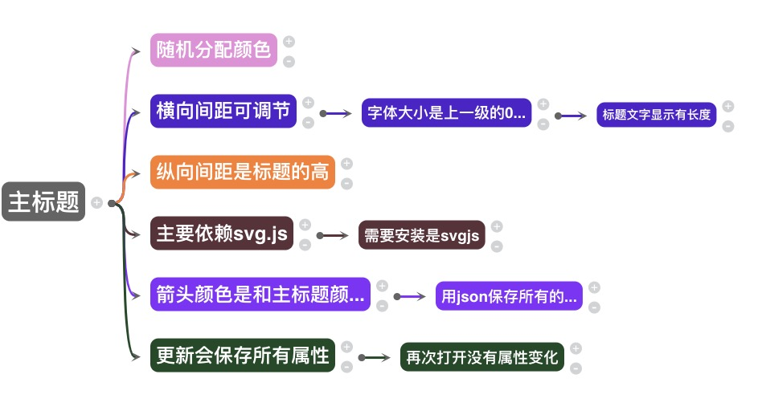

# vue-mind-mapping

A Vue component to mind-mapping
一个类似思维导图的小工具

 ## demo演示
 [demo](https://wei-zhe.github.io/#/mind)

  
 ## 安装
 
 ```JS
 npm install vue-mind-mapping -S
 ```
 
 ## 使用
 
 ```js
使用之前一定要安装svg.js
svg.js
    import svgJs from "svg.js/dist/svg"

    export default {
        install(Vue) {
            Vue.prototype.$svg = svgJs
        }
    }

main.js
    import svgJs from "./svg.js"
    Vue.use(svgJs);

 // ES6
 import vuemindmapping from 'vue-mind-mapping'
 
 Vue.use(vuemindmapping)

 <MindMapping 
    v-model     = "testData"
    :width      = 'width'
    :height     = 'height'
    :spacing    = '50'
    topColor    = '#646464'
    :fontSize   = '30'
    :fontLength = '10'
></MindMapping>

 ```
### width， height
初始宽高

### spacing
标题之间的横向间距，纵向间距是标题的高度

### topColor
主标题的颜色以及箭头颜色

### fontSize
标题文字大小，下一级标题文字大小是上一级的0.8最小是14

### fontLength
每个标题显示的字数显示不玩的会用...代替

## v-model
会返回一个json字符串，代表生成的导图数据格式，
要是想要加载生成的导图，需要一开始传入导图的json字符串

```js
    '{
        "x":5,
        "y":400,
        "title":"主标题",
        "index":0,
        "color":"#646464",
        "size":30,
        "sprites":[
            {
                "x":185,
                "y":-171.0703125,
                "title":"随机分配颜色",
                "index":1,
                "color":"#e78ed9",
                "size":24,
                "sprites":[ ]
            }
        ]
    }',
 ```

### Props
 
 |   name      |   type   | default | type |
 | --------    | :------: | :-----: | ---- |
 | value       | String	  |         | 必传
 | width       | Number	  | 500     | 选择参数，也可以不传
 | height      | Number	  | 500     | 选择参数，也可以不传
 | spacing     | Number	  | 50      | 选择参数，也可以不传
 | topColor    | String	  | #ff2970 | 选择参数，也可以不传
 | fontSize    | Number	  | 40      | 选择参数，也可以不传
 | fontLength  | Number	  | 7       | 选择参数，也可以不传
 